# Ship Architecture Diagrams

Visual representations of Ship's architecture using Mermaid diagrams.

## System Overview

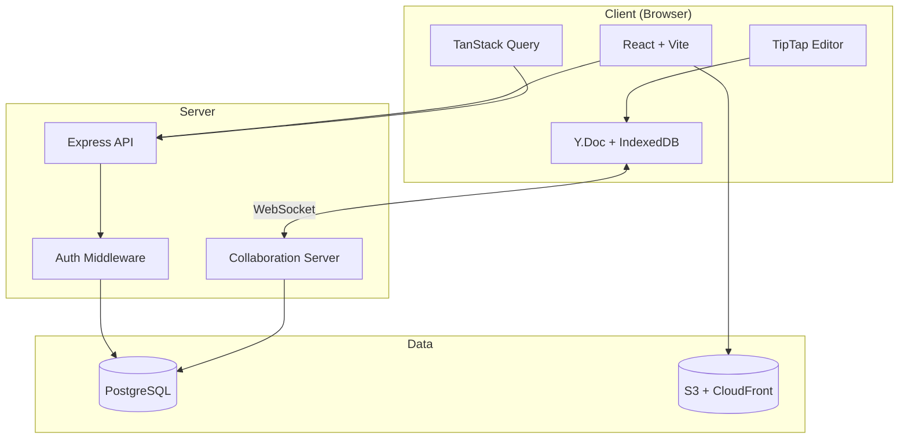

## 4-Panel Editor Layout

```
┌────────────────────────────────────────────────────────────────────┐
│ Header Bar                                                         │
├────────┬──────────────┬─────────────────────────┬──────────────────┤
│        │              │                         │                  │
│  Icon  │  Contextual  │     Main Content        │    Properties    │
│  Rail  │   Sidebar    │      (Editor)           │     Sidebar      │
│        │              │                         │                  │
│  48px  │    224px     │       flex-1            │      256px       │
│        │              │                         │                  │
│ - Wiki │ - Doc tree   │ - TipTap editor         │ - Title          │
│ - Issue│ - Issue list │ - Slash commands        │ - Status         │
│ - Prj  │ - Filters    │ - Mentions              │ - Priority       │
│ - Team │              │ - Collaboration         │ - Assignee       │
│        │              │                         │ - Week           │
└────────┴──────────────┴─────────────────────────┴──────────────────┘
```

## Data Flow: HTTP Request

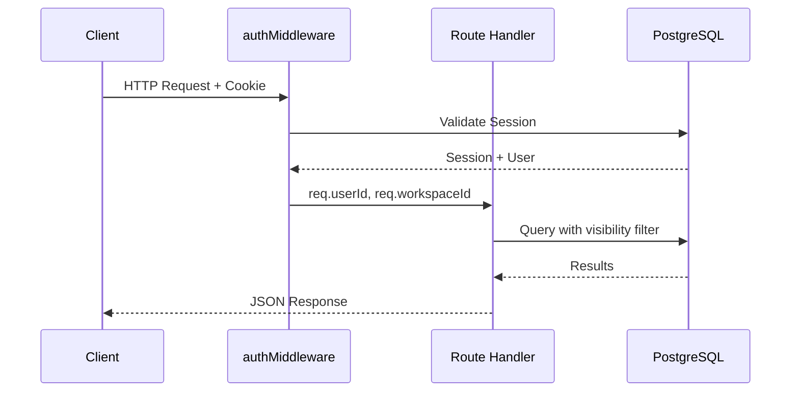

## Data Flow: Real-time Collaboration

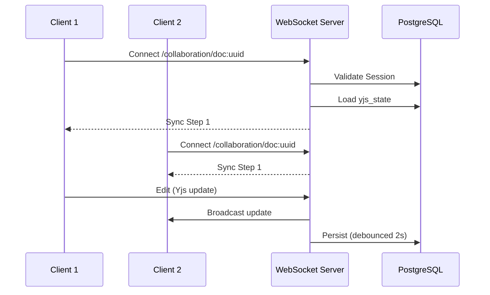

## Unified Document Model

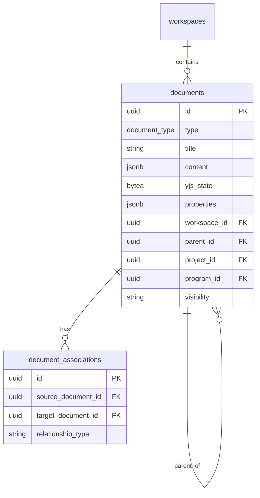

## Document Types

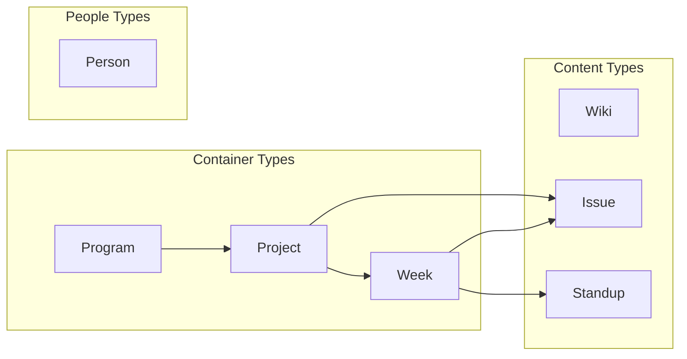

## Authentication Flow

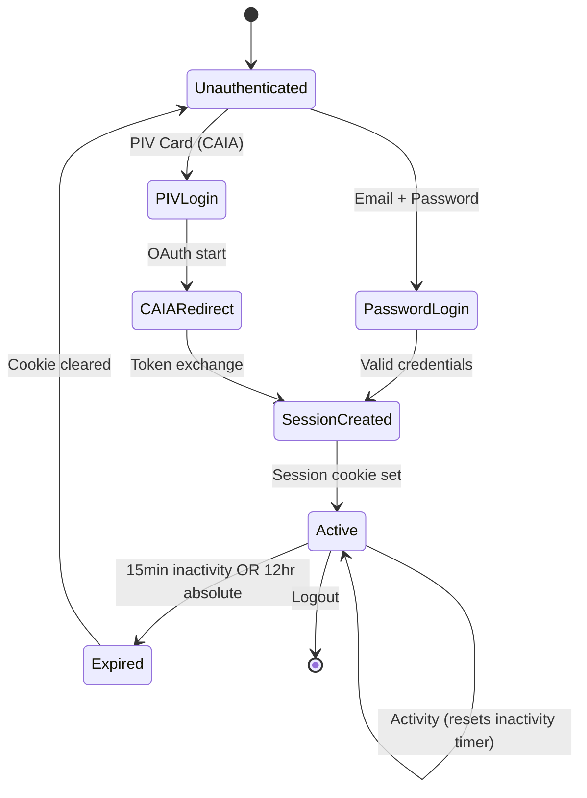

## WebSocket Connection States

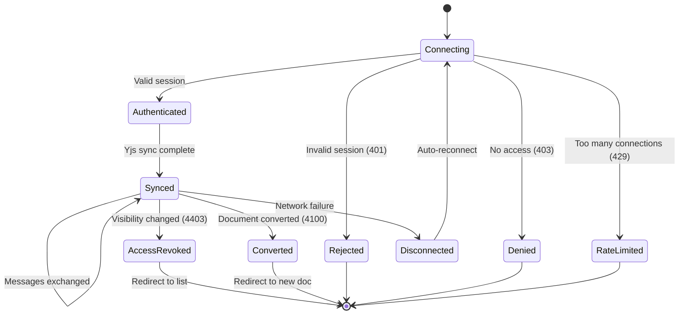

## Deployment Architecture

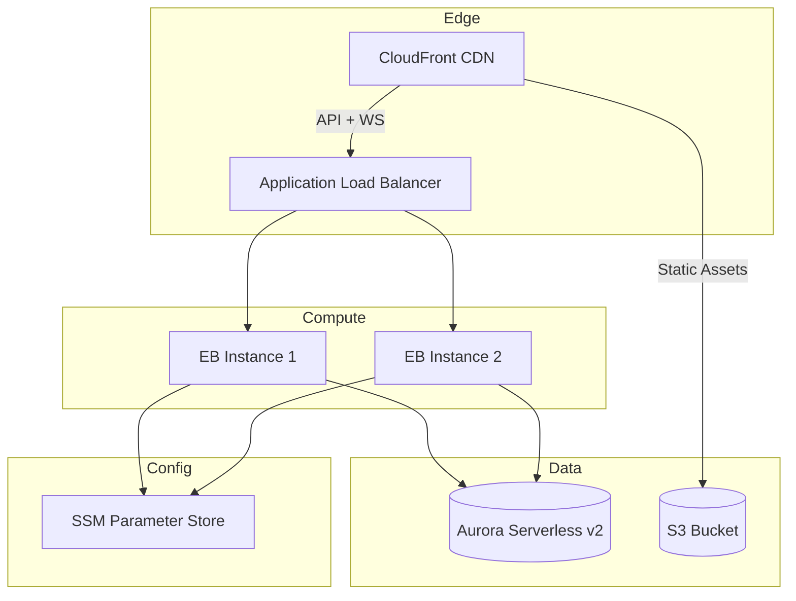

## Caching Strategy

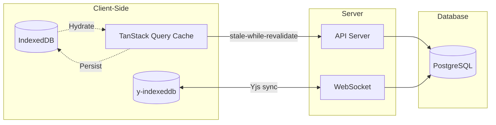

## Week Timeline

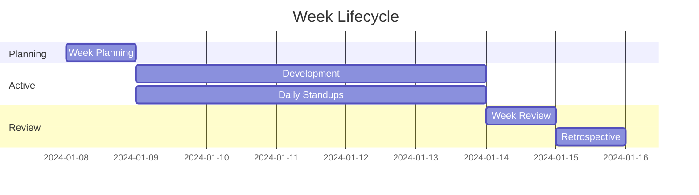

## Issue State Machine

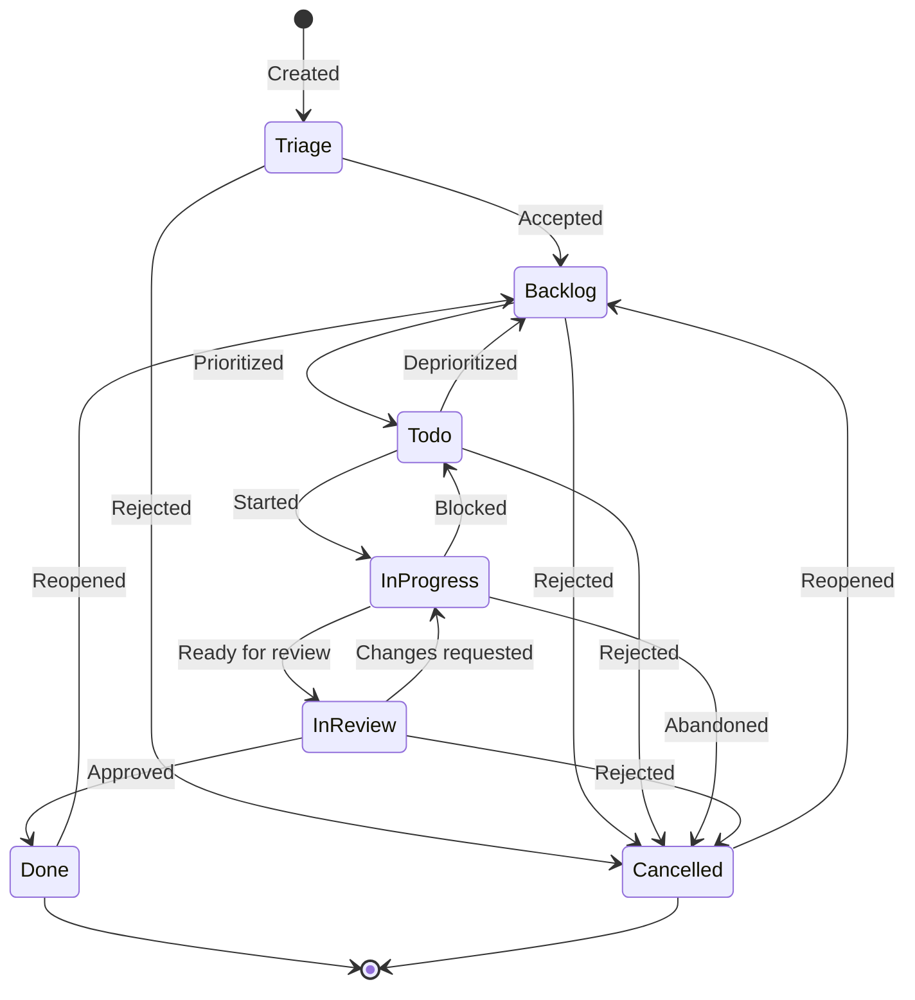

## Module Dependencies

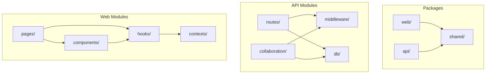
